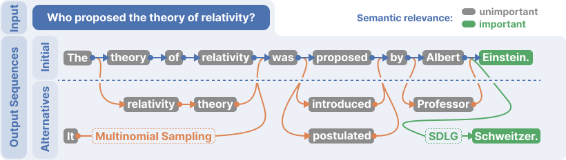

# Semantically Diverse Language Generation for Uncertainty Estimation in Language Models

_Lukas Aichberger<sup>1</sup>, Kajetan Schweighofer<sup>1</sup>, Mykyta Ielanskyi<sup>1</sup>, Sepp Hochreiter<sup>1, 2</sup>_

<sup>1</sup> ELLIS Unit Linz and LIT AI Lab, Institute for Machine Learning, Johannes Kepler University Linz, Austria  
<sup>2</sup> NXAI GmbH, Linz, Austria

---

## Key Insights

1. Provides a method to generate semantically diverse yet likely output sequences :brain:
2. Establishes a theoretical foundation for uncertainty measures in NLG :abacus:
3. Outperforms existing uncertainty estimation methods in free-form question-answering tasks :bar_chart:


## Abstract
Large language models (LLMs) can suffer from hallucinations when generating
text. These hallucinations impede various applications in society and industry by
making LLMs untrustworthy. Current LLMs generate text in an autoregressive
fashion by predicting and appending text tokens. When an LLM is uncertain about
the semantic meaning of the next tokens to generate, it is likely to start hallucinating.
Thus, it has been suggested that hallucinations stem from predictive uncertainty. We
introduce Semantically Diverse Language Generation (SDLG) to quantify predictive
uncertainty in LLMs. SDLG steers the LLM to generate semantically diverse yet
likely alternatives for an initially generated text. This approach provides a precise
measure of aleatoric semantic uncertainty, detecting whether the initial text is likely
to be hallucinated. Experiments on question-answering tasks demonstrate that SDLG
consistently outperforms existing methods while being the most computationally
efficient, setting a new standard for uncertainty estimation in LLMs.




## Installation

Clone the repository:

```bash
git clone git@github.com:ml-jku/SDLG.git
cd SDLG
```

Install the required dependencies:

```bash
pip install -r requirements.txt
```

### Running the Code

1. Set hyperparameters in ```args.py``` 

2. Run experiments with ```run_experiments.py```

3. Analyze results with ```analyze_results.ipynb```


## Contact

For support or queries, feel free to reach out at [aichberger@ml.jku.at].

## Citation

Please consider giving our work a star :star: and cite it

```
@article{aichberger2024sdlg,
      title={Semantically Diverse Language Generation for Uncertainty Estimation in Language Models}, 
      author={Lukas Aichberger and Kajetan Schweighofer and Mykyta Ielanskyi and Sepp Hochreiter},
      journal={arXiv preprint arXiv:2406.04306},
      year={2024}
}
```
