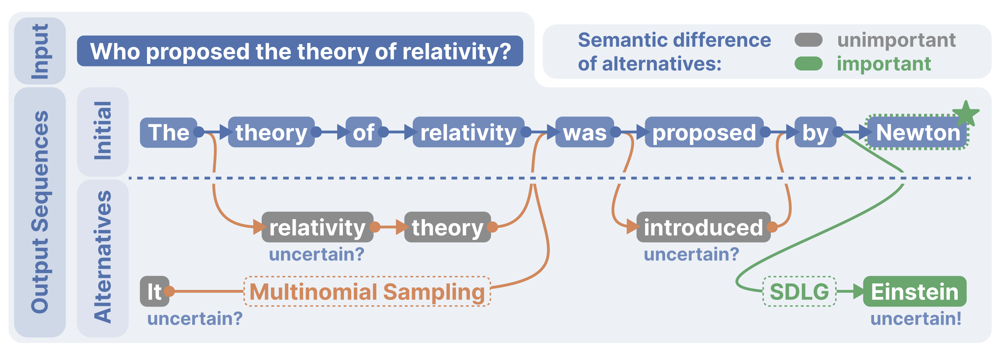

# SDLG

Reference implementation for **“Improving Uncertainty Estimation through
Semantically Diverse Language Generation,”** published at ICLR 2025
([paper](https://proceedings.iclr.cc/paper_files/paper/2025/file/b94d8b035e2183e47afef9e2f299ba47-Paper-Conference.pdf)).

Lukas Aichberger, Kajetan Schweighofer, Mykyta Ielanskyi, and Sepp Hochreiter

## Method

Semantically Diverse Language Generation (SDLG) produces likely alternatives
to an initially generated answer while explicitly encouraging semantic
diversity. The resulting sequences are grouped by bidirectional textual
entailment and used to estimate semantic uncertainty.

## Installation

The tested environment uses Python 3.11. Create an isolated environment and
install the pinned dependencies:

~~~bash
python -m venv .venv
source .venv/bin/activate
python -m pip install --upgrade pip
python -m pip install -r requirements.txt
~~~

The installation includes BLEURT and TensorFlow because the experiment script
computes all three correctness measures reported in the paper: ROUGE-L,
ROUGE-1, and BLEURT. Model weights and metric checkpoints are downloaded when
first used.

FlashAttention is disabled by default. It can be enabled with
`use_flash_attention` in `args.py` after installing a compatible
`flash-attn` build for the local CUDA and PyTorch versions.

## Running an experiment

The original workflow is retained:

1. Select the dataset, model, run identifier, and generation parameters in
   `args.py`.
2. Run generation, likelihood computation, and semantic-pair classification:

   ~~~bash
   python run_experiments.py
   ~~~

3. Set the corresponding dataset and run identifier in
   `analyze_results.ipynb`, then execute the notebook to compute AUROC values
   and plots.

The default configuration compares SDLG with multinomial sampling. The
existing baseline parameters in `args.py` can also configure grouped diverse
beam search; no additional baseline implementations are included. For ten
sequences in total (the initial sequence and nine DBS alternatives), use:

~~~python
self.num_beams_baseline = 9
self.num_return_sequences_baseline = 9
self.num_beam_groups_baseline = 9
self.diversity_penalty_baseline = 0.5
self.do_sample_baseline = False
~~~

`num_total_generations` counts the initial most-likely answer and all
additional answers. Existing result files are skipped so interrupted runs can
be continued. Set `overwrite_existing = True` only when results for the same
run identifier should be recomputed. Full-vocabulary logits are used
temporarily by SDLG but are not stored unless `store_logits = True`.

Set cache and visible-device locations in the shell when required:

~~~bash
export HF_HOME=/path/to/huggingface-cache
export CUDA_VISIBLE_DEVICES=0,1
export SDLG_CUDA_ID_LLM=0
export SDLG_CUDA_ID_DEBERTA=0
~~~

The experiments require substantial GPU memory. The 30B and 66B OPT branches
retain the original four-GPU device maps in `utils.py`; smaller models use the
selected single device.

## Data

Dataset files are not stored in this repository. Prepare the required datasets
locally after installing the dependencies:

~~~bash
python datasets/parse_coqa.py
python datasets/parse_triviaqa.py
python datasets/parse_truthful_qa.py
~~~

The scripts download fixed upstream versions and create the directories read
by `run_experiments.py`. The resulting CoQA development, TriviaQA validation,
and TruthfulQA datasets contain 7,983, 17,944, and 812 evaluation examples,
respectively. The generated directories are excluded from version control.

TriviaQA uses the first ten training examples as demonstrations; they do not
overlap with the default validation split. TruthfulQA uses five questions from
the same benchmark revision as demonstrations, and the preprocessing script
excludes them from evaluation. CoQA instead supplies the preceding turns of
each conversation as context.

The final paper reports ~8,000 examples from the TriviaQA training split.
To prepare that split, excluding the ten few-shot examples, run:

~~~bash
python datasets/parse_triviaqa.py \
  --split train \
  --max-examples 8000
~~~

Local source files can be supplied explicitly when needed:

~~~bash
python datasets/parse_coqa.py /path/to/coqa-dev-v1.0.json
python datasets/parse_truthful_qa.py /path/to/TruthfulQA.csv
~~~

The TruthfulQA preprocessing is based on the
[817-question benchmark revision](https://github.com/sylinrl/TruthfulQA/blob/fdd8ad1c0d00a478cf8b0bb41a3ad8378c16293b/TruthfulQA.csv)
available before its January 2025 update. CoQA and TruthfulQA downloads are
checked against their expected SHA-256 hashes, and the TriviaQA loader is
pinned to the revision used by the original repository.

## Tests

Install the development dependencies and run all tests with:

~~~bash
python -m pip install -r requirements-dev.txt
python -m pytest
~~~

Using `python -m pytest` runs pytest with the same Python interpreter in which
the dependencies were installed. Pytest reads its configuration from
`pyproject.toml`, discovers the tests in `tests/`, and requires neither model
downloads nor a GPU.

## Citation

~~~bibtex
@inproceedings{aichberger2025sdlg,
  author    = {Aichberger, Lukas and Schweighofer, Kajetan and
               Ielanskyi, Mykyta and Hochreiter, Sepp},
  title     = {Improving Uncertainty Estimation through Semantically Diverse
               Language Generation},
  booktitle = {The Thirteenth International Conference on Learning Representations},
  year      = {2025},
  url       = {https://proceedings.iclr.cc/paper_files/paper/2025/file/b94d8b035e2183e47afef9e2f299ba47-Paper-Conference.pdf}
}
~~~

## License

The software is distributed under the [BSD 3-Clause Clear License](LICENSE).

Datasets remain subject to their respective upstream licenses and terms.
See the official
[CoQA](https://stanfordnlp.github.io/coqa/),
[TriviaQA](https://nlp.cs.washington.edu/triviaqa/), and
[TruthfulQA](https://github.com/sylinrl/TruthfulQA) sources for details.
